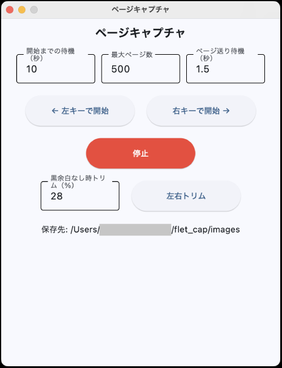

# ページキャプチャツール

画面を連続キャプチャし、各キャプチャ後に矢印キーでページを送る GUI ツールです。<br />
スライド資料など、キー操作でページ送りできる画面の連続保存に使用できます。<br />
保存後は「左右トリム」機能で各画像左右の「黒余白」を自動で切り落とせます。



## 動作環境

- Windows 10 / 11、macOS
- Python 3.14
- 依存パッケージ
  - pyautogui（画面キャプチャ・キー送信）
  - Pillow（JPEG 保存・トリム処理）
  - flet（GUI）

### Windowsバイナリ配布URL

[https://tatenosystem.site/files/](https://tatenosystem.site/files/)

## セットアップ

依存パッケージをインストールします。

Windows（PowerShell / コマンドプロンプト）:

```powershell
python -m pip install -r requirements.txt
```

macOS:

直接インストール

```bash
python3 -m pip install -r requirements.txt
```

仮想環境(venv)

```bash
python3 -m venv .venv
source .venv/bin/activate
python3 -m pip install -r requirements.txt
```

インストール済みのパッケージは以下で確認できます。

```bash
python -m pip list
```

macOS では初回実行時に以下の権限が必要です（システム設定 → プライバシーとセキュリティ）。

- **画面収録**: スクリーンショット取得のため
- **アクセシビリティ**: キー送信のため

## 使い方

コマンドラインからスクリプトを起動します。

Windows:

```powershell
python capture_pages_gui.py
```

macOS:

```bash
python3 capture_pages_gui.py
```

### キャプチャ

1. 設定欄に「開始までの待機（秒）」「最大ページ数」「ページ送り待機（秒）」を入力する
2. ページ送りの方向に応じて「← 左キーで開始」または「右キーで開始 →」を押す
3. カウントダウン中にキャプチャ対象の資料を前面に表示し、キー入力が届く状態にする
4. カウントダウン終了後、自動でキャプチャとページ送りが繰り返される

- **停止ボタン**: カウントダウン中・キャプチャ中いつでも中断できます
- 進捗・完了・エラーはウインドウ下部のステータス欄に表示されます
- `images/` フォルダに既存ファイルがある場合は、上書き防止のため開始できません（退避または削除してください）

### 左右トリム

キャプチャ済みの画像の左右の黒余白を自動検出して切り落とします。

1. 「黒余白なし時トリム（%）」に、黒余白が検出できなかった場合に左右から削る割合（0 以上 50 未満）を入力する
2. 「左右トリム」ボタンを押す

- 画像端から中央へ走査してコンテンツ端（黒余白の内側）を検出し、`images/` 内の全画像を上書きトリムします
- 左右どちらにも黒余白がない画像は、指定した％で左右をトリムします
- 先頭画像が縦長（高さ > 幅）の場合はトリムをスキップします

## 保存先とファイル名

- 保存先: プログラムと同じフォルダの `images/`
- ファイル名: `page-0001.jpg`、`page-0002.jpg`、…（連番）
- 形式: JPEG（品質 95、`optimize` 有効）

## 自動終了の仕組み

キャプチャしたファイルのサイズが前ページと完全に一致した場合、ページが進んでいない（＝最終ページに到達した）と判定します。<br />
重複した最後のファイルは削除され、処理は自動で終了します。

## 緊急停止

- **マウスを画面左上へ移動**: pyautogui のフェイルセーフ機能により即座に停止します
- 「停止」ボタンでも中断できます

## 主な設定値（ソース内定数）

`capture_pages_gui.py` 冒頭で調整できます。

| 定数 | 既定値 | 説明 |
| --- | --- | --- |
| `BEFORE_CAPTURE_WAIT_SECONDS` | `0.3` | キャプチャ直前の待機時間（秒） |
| `JPEG_QUALITY` | `95` | JPEG 品質（1〜100） |
| `TRIM_MARGIN_COLOR` | `(0, 0, 0)` | 余白とみなす色（黒） |
| `TRIM_RGB_DIFF` | `50` | 各チャンネルの許容差 |
| `TRIM_SUM_RGB_DIFF` | `70` | RGB 合計の許容差 |
| `TRIM_MATCH_REQUIRED` | `2` | 同一トリムサイズが連続一致してサイズ確定するまでの回数 |
| `CAPTURE_REGION` | `None` | 撮影範囲 `(左X, 上Y, 幅, 高さ)`。`None` で全画面 |
| `START_PAGE_NUMBER` | `1` | 開始ページ番号 |
